# report-rs User Manual

This manual describes `report-rs v0.1.0-alpha.1`. Because this is an alpha
release, the interface and JSON format may change in later versions.

## 1. Applications

The release contains two graphical applications:

- `report-designer` creates and edits `.report.json` templates.
- `report-preview` renders a report, displays its pages and exports PDF.

Start Designer without arguments to create an empty report, or pass a report
path to open it immediately:

```bash
./report-designer
./report-designer examples/group_products.report.json
```

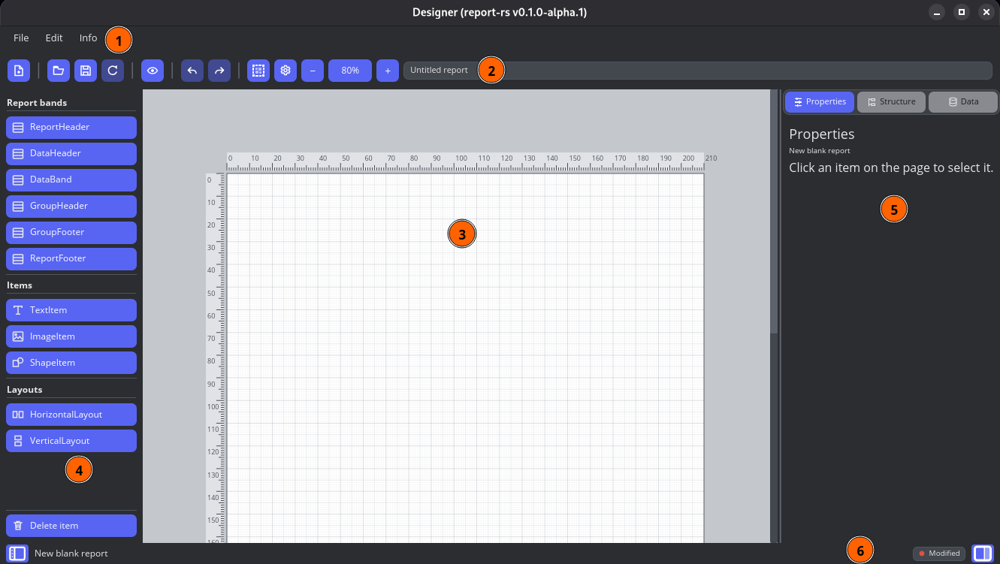

*Figure 1 — Main Designer window.*

The numbered areas in the screenshot are:

1. Main menu: File, Edit and Info.
2. Toolbar and current report path.
3. Design canvas with grid and millimetre rulers.
4. Toolbox for bands, items and layouts.
5. Properties, Structure and Data panel.
6. Status bar and document state (`Modified` or `Saved`).

## 2. Designer interface

The toolbar provides New, Load, Save, Reload, Preview, Undo and Redo. It also
contains controls for rulers, report settings and canvas zoom. The current
report path is shown on the right.

The left Toolbox contains:

- Report Header, Data Header, DataBand, Group Header, Group Footer and Report
  Footer bands.
- Text, Image and Shape items.
- Horizontal and Vertical layouts.
- Delete.

The right panel has three tabs:

- **Properties** edits the selected band or item.
- **Structure** shows the complete report hierarchy and supports rename,
  multi-selection and drag-and-drop.
- **Data** manages database connections, queries and query fields.

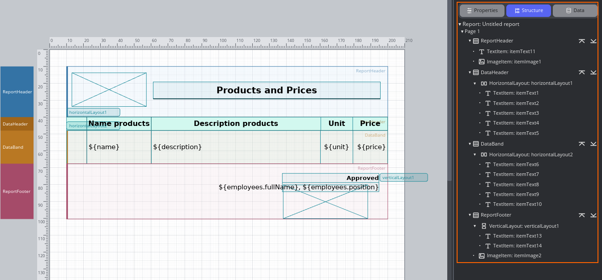

*Figure 2 — Structure shows bands, layouts and their child items. Select an
entry to select the corresponding object on the canvas.*

## 3. Basic workflow

1. Create a new report or load an existing `.report.json` file.
2. Open Report settings and configure page orientation, margins and default
   font.
3. Add the required bands.
4. Configure a data source and query when the report uses database data.
5. Add items manually or generate a table from query fields.
6. Save the report.
7. Open Preview and verify all pages.
8. Export the final PDF from Preview.

Unsaved changes are marked by Designer. Reload discards the in-memory document
and reads the last saved version from disk.

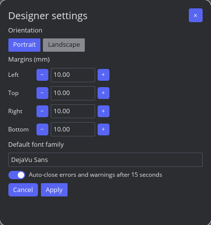

*Figure 3 — Open Designer settings from the gear button or Edit menu. Use
Apply to confirm changes. The dialog also controls automatic dismissal of
errors and warnings after 15 seconds.*

## 4. Data sources and queries

Open the **Data** tab and add a SQLite data source. Database paths stored in a
report may be relative; relative paths are resolved from the directory that
contains the report file. This is the recommended form for portable examples.

Create a named query and enter its SQL statement. Report parameters can be used
as named SQL parameters, for example `:position`. Query fields become available
after the query is saved or inspected.

Query rules support filters and sorting. Preview rules shows the number of rows
before and after filtering and a sample of the result.

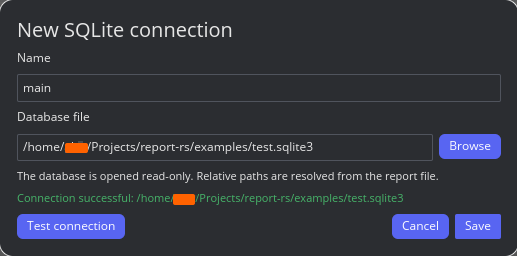

*Figure 4 — Enter the connection name and database file, use Test connection,
then Save. SQLite connections are opened read-only. The screenshot uses an
absolute path; use a relative path such as `test.sqlite3` for a portable report.*

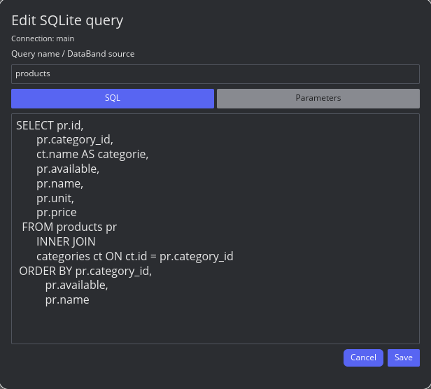

*Figure 5 — The SQL tab edits the query; the Parameters tab configures its
parameters. Filters, sorting and Preview rules are in the separate query-rules
dialog, not in the SQL editor shown here.*

## 5. Bands

Bands determine when their contents are printed:

| Band          | Behaviour                                                   |
| ------------- | ----------------------------------------------------------- |
| Report Header | Printed once at the beginning of the report.                |
| Data Header   | Column header associated with a query; may repeat on pages. |
| DataBand      | Printed once for every row returned by its query.           |
| Group Header  | Printed when the selected grouping field changes.           |
| Group Footer  | Printed after the last row of each group.                   |
| Page Header   | Printed at the top of every physical page.                  |
| Page Footer   | Printed at the bottom of every physical page.               |
| Report Footer | Printed once after all report data.                         |

Select a band to edit its height and data source. Group bands also expose the
group field. A Group Header can repeat when its group continues on another
page.

Page Header and Page Footer are supported by the JSON model and renderer, but
do not currently have creation buttons in the alpha Designer Toolbox.

## 6. Items and layouts

Select a band, then choose an item from the Toolbox. Items are positioned in
millimetres relative to their band. They can be selected, moved and resized on
the canvas or edited precisely in Properties.

Text properties include content, value type, query field, number/date format,
font, text colour, alignment, padding, background and borders. Editable fields
provide the Copy, Cut, Paste and Select all context menu.

Horizontal and Vertical layouts keep child items aligned. Layouts can be nested,
reordered in Structure and dismantled from the contextual menu.

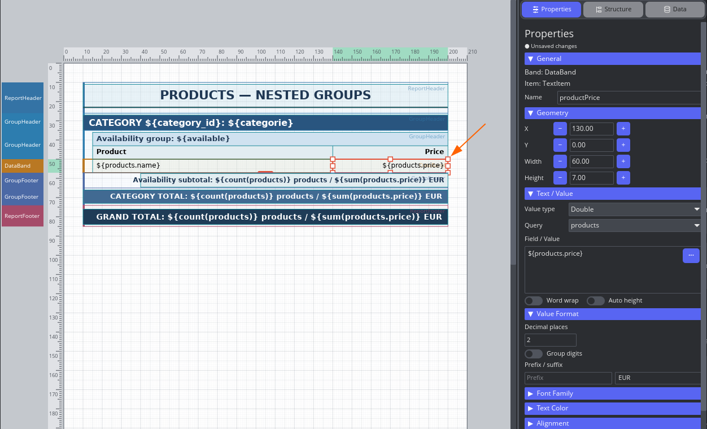

*Figure 6 — The selected `productPrice` item uses query `products`, the
`${products.price}` reference and two decimal places. Value Format also provides
prefix, suffix and digit grouping.*

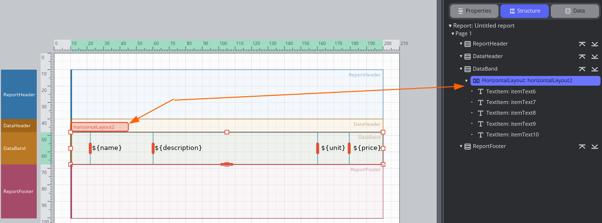

*Figure 7 — A HorizontalLayout and its child TextItems. The arrows show the
same layout on the canvas and in Structure. This screenshot shows one layout
level; layouts can also contain other layouts.*

## 7. Text values and functions

A Text item can display literal text, a query field or an expression. Common
references are:

```text
${field}
${QueryName.field}
${parameter.parameter_name}
${row_number}
```

Choose the `Function` value type and use the selection button beside Text/Value
to insert a supported function:

```text
${count(products)}
${sum(products.price)}
${average(products.price)}
${min(products.price)}
${max(products.price)}
```

In a Group Footer, aggregates for that band's query operate on the current
group. In a Report Footer, they operate on the complete query result. An
aggregate referencing a different query still uses that query's complete result.

For a formatted subtotal, use a separate TextItem with Value type `Function`
and a single expression, such as `${sum(products.price)}`. Set Decimal places
to `2` and the suffix to ` EUR`. This produces values such as `5.50 EUR`.
Formatting does not apply independently to numbers embedded in a longer text
such as `Total: ${sum(products.price)} EUR`.

Conditional expressions are not yet part of the alpha expression language.
Create conditional labels in SQL instead:

```sql
CASE WHEN available = 1 THEN 'available' ELSE 'unavailable' END
    AS availability_label
```

Then use `${availability_label}` in the report.

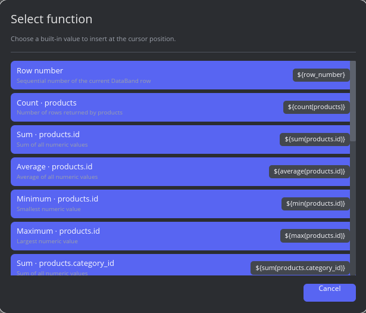

*Figure 8 — Click a function to insert it. Query aggregates are listed for
available numeric fields; scroll to find the required field, such as `price`.
Although numeric IDs also appear, their sums are usually not useful totals.*

## 8. Generate Table

Select query fields in the Data tab and generate or drag them to an empty
DataBand/Data Header. The `Create table from query` dialog allows you to:

- Rename and reorder columns.
- Set column widths and alignment.
- Configure value type, decimals, date pattern, prefix and suffix.
- Centre the table in the printable area.
- Add the `${row_number}` column automatically.
- Add one or more grouping levels.
- Enable Header and Footer with totals separately for every group.
- Save and reuse table templates.

Use **Data only** to omit the column header, or **Header + Data** to include it.
Configured grouping levels are generated with either button. Numeric columns
receive automatic `sum()` items
in generated Group Footers. Group fields are added to query sorting in the same
outer-to-inner order shown in the dialog.

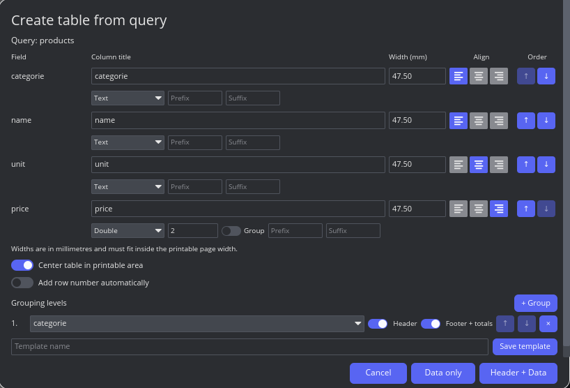

*Figure 9 — The screenshot groups by `categorie`, with Header and Footer +
totals enabled. Automatic row numbering is off. Use + Group for additional
levels and ↑/↓ to change their order.*

Grouping fields must be among the selected columns. To generate the two-level
example below, select `category_id` and `available` as well as the data fields,
then add both groups in that order. Review generated numeric totals and remove
any that are not meaningful, such as sums of IDs.

## 9. Grouped reports

For manual grouping, data must be sorted by the grouping fields from the
outermost group to the innermost group:

```sql
ORDER BY category_id, available, name
```

The corresponding band order is:

```text
Group Header: category_id
Group Header: available
DataBand
Group Footer: available
Group Footer: category_id
```

The engine opens outer groups first and closes inner groups first. See
`examples/group_products.report.json` and
`examples/nested_group_products.report.json`.

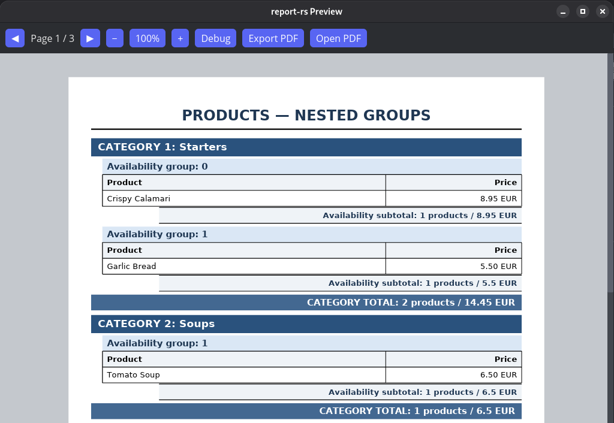

*Figure 10 — Category is the outer group and availability is the inner group.
In this example, `0` means unavailable and `1` means available. Each subgroup
has its own subtotal, followed by the category total.*

## 10. Images

An Image item can use a file or a database BLOB:

- **File** stores a path in `source`. Prefer a path relative to the report.
- **Database BLOB** selects a query and BLOB field. PNG, JPEG and SVG content is
  supported.

Fit can stretch the image to its bounds or preserve the aspect ratio with
Contain.

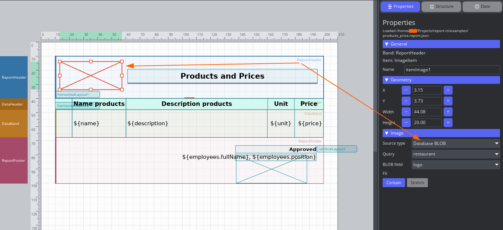

*Figure 11 — The ImageItem reads `logo` from the `restaurant` query and uses
Contain. A database image is represented by a crossed rectangle in Designer;
open Preview to see the decoded image.*

## 11. Preview and PDF

Press Preview after saving the report. Required parameters are requested before
rendering. The Designer status bar reports the current stage and progress.
After completion it shows data, layout, image and total processing time.

Preview supports page navigation and zoom. Use **Export PDF** to export all
rendered pages and **Open PDF** to open the PDF in an external viewer. When
available, **Parameters** lets you change parameter values and render again.

Export PDF opens a Save dialog (requires `zenity` on Linux). Choose a filename
ending in `.pdf`; the exact selected filename is used. The initial suggestion
is `output.pdf` beside the report, or the last successful export location.
The dialog confirms overwriting existing files. Cancel leaves files unchanged.
After export, Preview opens the PDF using `xdg-open`. Open PDF is enabled after
a successful export and reopens that file; it does not regenerate it after
parameter changes. Export again to include those changes.

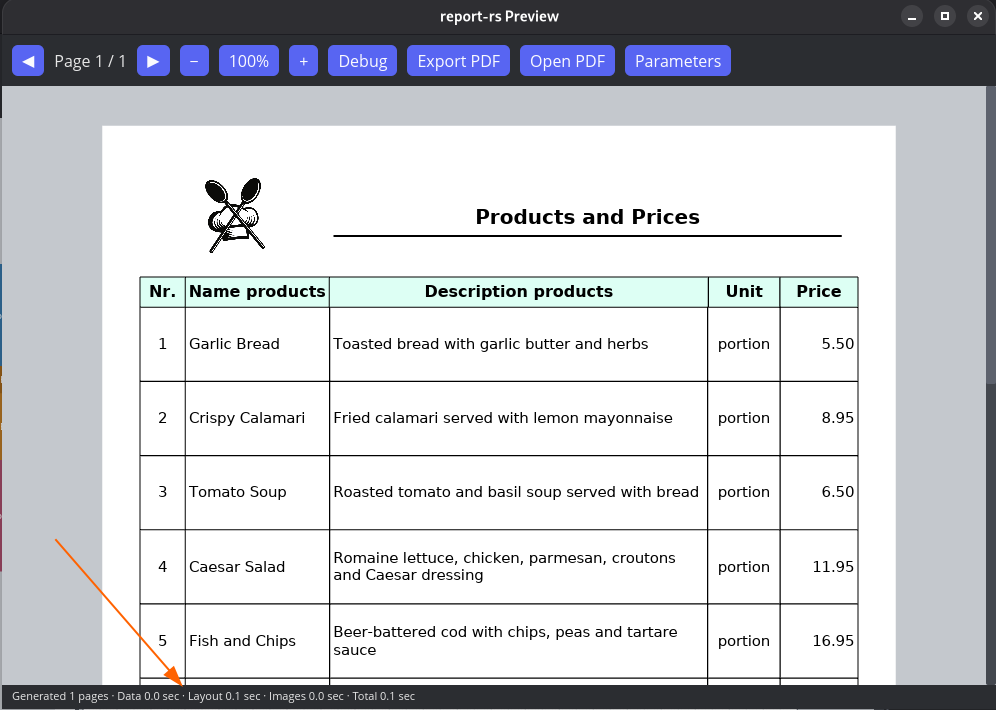

*Figure 12 — The bottom status bar shows generated page count and Data, Layout,
Images and Total processing times. These are timings for the current report,
not a fixed performance guarantee.*

## 12. Keyboard shortcuts

| Shortcut                   | Action                              |
| -------------------------- | ----------------------------------- |
| `Ctrl+S`                   | Save                                |
| `Ctrl+Shift+S`             | Save as                             |
| `Ctrl+Z`                   | Undo                                |
| `Ctrl+Y` or `Ctrl+Shift+Z` | Redo                                |
| `Ctrl+C`                   | Copy                                |
| `Ctrl+X`                   | Cut                                 |
| `Ctrl+V`                   | Paste                               |
| `Ctrl+A`                   | Select all items in the active band |
| `Delete`                   | Delete selection                    |
| `F2`                       | Rename the selected Structure item  |
| `Escape`                   | Cancel Structure rename             |

## 13. Troubleshooting

**The query cannot open its database**

Check whether the SQLite path is correct relative to the report file.

**A grouping value appears more than once**

Sort the query by every grouping field in outer-to-inner order, or generate the
table again so Designer adds the sorting rules automatically.

**An image is empty**

For a file image, verify its relative path. For a database image, verify that
the selected field contains a supported BLOB rather than text or `NULL`.

**Text is clipped**

Enable word wrapping and automatic height, increase the item or band height, or
use Fit band to contents.

**A monetary sum shows too many decimals**

Use a separate TextItem containing only `${sum(products.price)}`, set Value type
to `Function` and Decimal places to `2`. Put the currency in Suffix and any label
in Prefix or another TextItem. A longer text containing several placeholders
does not format each embedded number independently.

## 14. JSON files and compatibility

Designer is the recommended way to edit reports, but templates remain readable
JSON. Keep the report, relative SQLite database and relative image files in the
same distributable directory structure. Back up important templates before
opening them with a newer alpha version.
